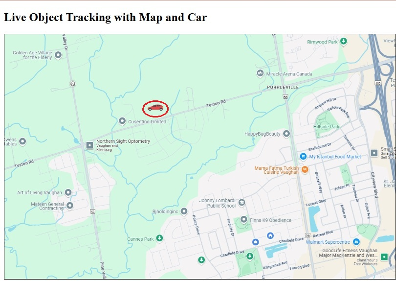
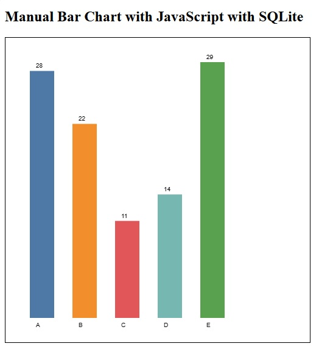
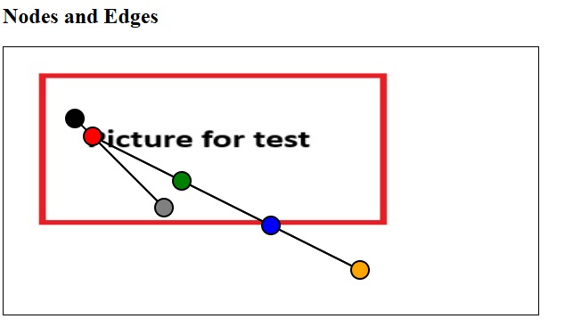
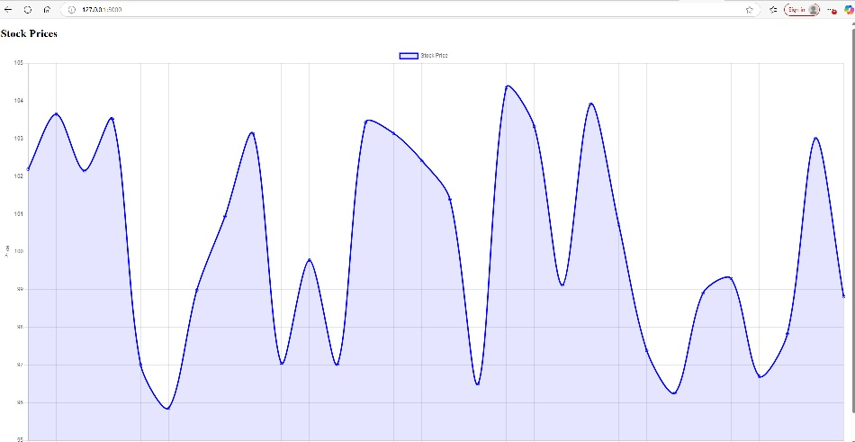

## Python Graphics
### ✅ Moving Image

Moving an Image Over a Background Using Python, Flask, and JavaScript
In this example, we demonstrate how to move an image (e.g. a marker or icon) across the background of another image (e.g. a map) using the following technologies:

1-Python with Flask – to create the web server and serve an API.
2-HTML – to structure the web page.
3-JavaScript – to fetch updated positions and animate the image.
4-SQLite – to store and update a single record representing the image's position.

Steps to Run the Example
1-Open a Windows terminal session (Command Prompt or PowerShell).
2-Navigate to your project folder.
3-Run the Flask application using:

```
python app.py
```

Then open your browser and go to http://127.0.0.1:5000 to see the result. The refersh happens every 2 seconds



<a href="moving-img/">Moving image code script</a>

### ✅ Bar
Dynamic Bar Chart from SQLite Using Flask and JavaScript
This example demonstrates how to dynamically generate a bar chart by reading data from a SQLite database. The database table contains two columns:

1-label – predefined category names (e.g. A, B, C, etc.)
2-value – randomly generated numeric values associated with each label
3-The chart updates based on the latest data retrieved from the database.

Technologies Used
To implement this functionality, we use the following components:

1-Python with Flask – to serve the web page and provide an API for fetching data.
2-HTML – to structure the page.
3-JavaScript – to retrieve the data and render the bar chart.
4-SQLite – to store label-value pairs.

This setup allows for a simple yet powerful way to visualize real-time or dynamic data in a web browser.

Run the script to build the database in SQLite
```
python setup_bar_data.py
```

To run the flask server
```
python app.py
```

After running the command above, open your browser and navigate to http://127.0.0.1:5000 to view the bar chart. The chart automatically refreshes every 5 seconds. 

To generate or update the data, run the following Python command: "python setup_bar_data.py"

This script populates the SQLite database with new random values. Once the page refreshes, the updated values will be reflected in the bar chart.

This bar char changes when we run the script to create new data



<a href="bar/">Bar code script</a>

### ✅ Vertices(Nodes) and Edges

The vertices and edges are drawn over a background image. When the data generation script is updated, the displayed graph reflects the new data automatically.

To generate the table with data, we run:

```
python setup_db.py
```

The idea behind this image visualization is to dynamically display vertices (nodes) and edges over a background image. When the data in the Nodes and Edges tables is updated, the image automatically reflects these changes. The visualization refreshes every 3 seconds to ensure it stays in sync with the underlying data.

To run the flask server
```
python app.py
```

After we run the command above, we can goto http://127.0.0.1:5000 to check the bar. The resfersh happens every 3 second. 



<a href="nodes-edges/">Node and edges code script</a>

### ✅ Stock

This implementation generates a stock chart based on data from the stock_prices table in the SQLite database.

```
python setup_stock_db.py
```

To geenrate the stock chart dynamically, we will need:

1- Python with Flask (Flask for web server and API)
2- HIML page
3- Java Script to build the chart
4- SQLite to keep the number of labels with their random values

After running the command above, open your browser and visit http://127.0.0.1:5000 to view the bar chart. The chart automatically refreshes every 3 seconds to display the latest data.



<a href="stock/">stocker code script</a>